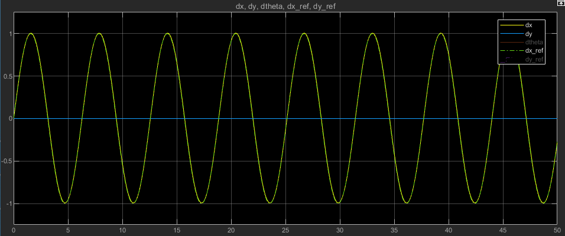

# caracciolo-1998-control-implementation
An implementation of the four-wheel differential drive vehicle model and open-loop nonlinear feedback law derived in [Caracciolo 1999](https://doi.org/10.1109/ROBOT.1999.773994).

## Example
Vehicle body longitudinal velocity tracking a sinusoidal reference input:

